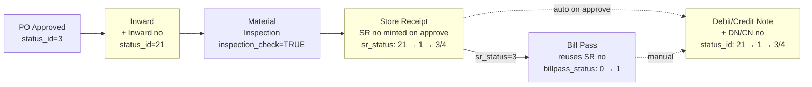
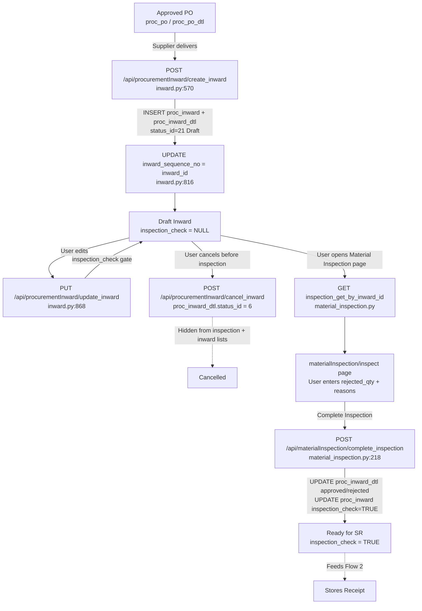
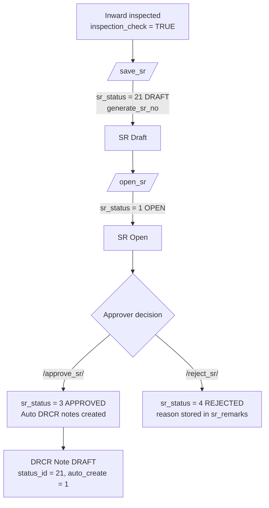
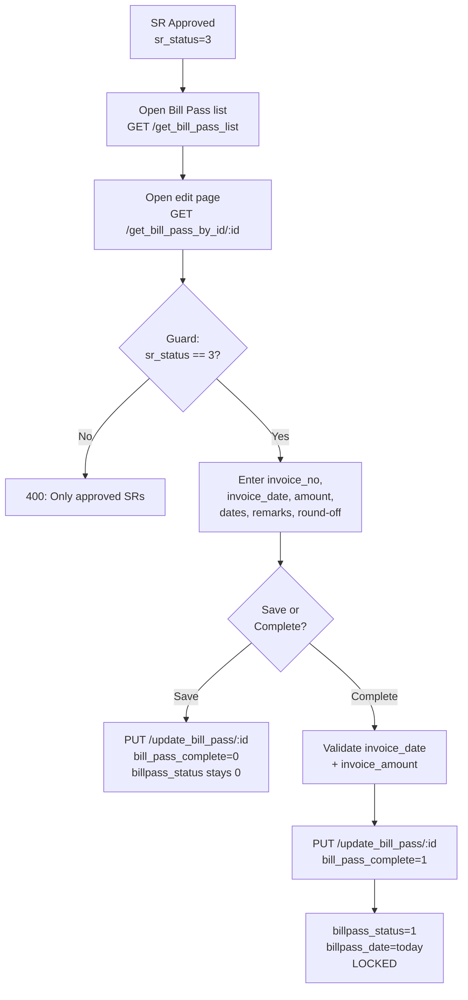
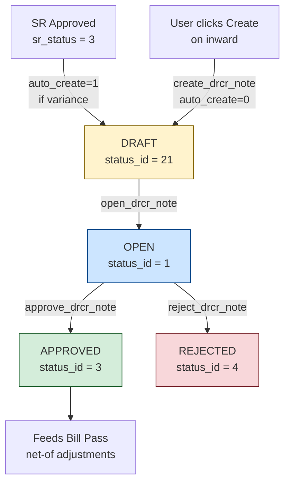
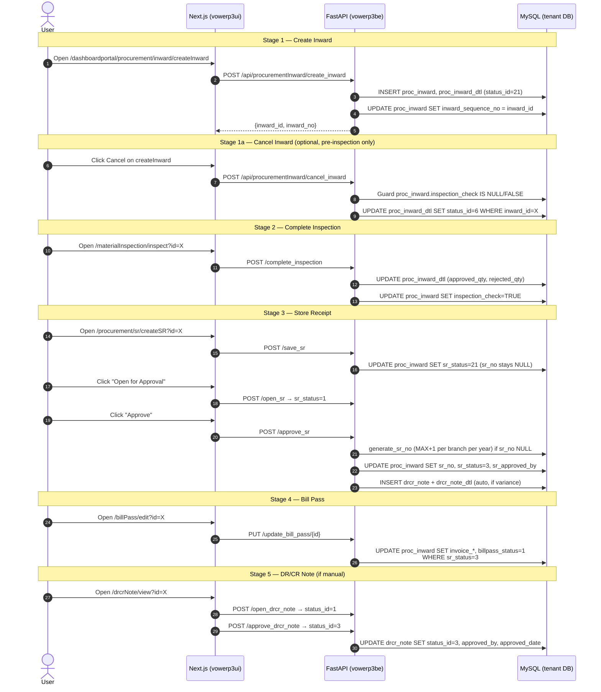

# Procurement Inward → Bill Pass Approval Flows

> **Audience:** engineers working on the VoWERP3 procurement chain.
> **Scope:** PO approved → Inward → Material Inspection → Store Receipt (SR) → Bill Pass → Debit/Credit Notes.
> **Covers:** backend ([c:\code\vowerp3be](c:\code\vowerp3be)) **and** frontend ([c:\code\vowerp3ui](c:\code\vowerp3ui)).

---

## 1. Overview

The procurement approval pipeline takes an approved Purchase Order through five sequential stages. Each stage is a FastAPI router + a Next.js page, gated by a `status_id` (or `sr_status` / `billpass_status`). Document numbers are minted at stage-specific points (see cheat sheet below). Inventory movement is **not** triggered by any stage in this chain directly — it is handled downstream of Bill Pass.

### Master flow diagram



Nodes highlighted yellow mint a document number.

---

## 2. Shared Conventions

### Status IDs (`status_mst`)

| status_id | Meaning |
|-----------|---------|
| 21 | DRAFT |
| 1 | OPEN |
| 20 | PENDING_APPROVAL (multi-level) |
| 3 | APPROVED |
| 4 | REJECTED |
| 6 | CANCELLED |

`proc_inward` adds `sr_status` (reuses same ID space) and `billpass_status` (0/1 boolean).

### Auth + DB dependency

Every endpoint uses:

```python
db: Session = Depends(get_tenant_db)                        # tenant DB
token_data: dict = Depends(get_current_user_with_refresh)   # JWT cookie
```

Defined in [src/config/db.py](src/config/db.py) and [src/authorization/utils.py](src/authorization/utils.py). Tenant DB resolved from subdomain.

### Document-number timing at a glance

| Stage | Number assigned at… |
|-------|---------------------|
| Inward | Immediately after `INSERT proc_inward` (sequence = inward_id PK) |
| SR | On `/approve_sr` (when `sr_status` flips to 3) |
| Bill Pass | Reuses SR number — nothing new minted |
| Debit/Credit Note | After `INSERT drcr_note` (prefix + note_id PK) |

---

## Flow 1 — Procurement Inward

This flow covers receipt of materials against an approved Purchase Order (PO), generation of an Inward number (formerly "GRN" — renamed to keep terminology consistent with the `proc_inward` table), and the downstream Material Inspection step that gates Stores Receipt (SR) creation. A pre-inspection **Cancel Inward** path is also available.

### Flow diagram



> **Note:** Cancel is allowed only while `inspection_check` is NULL/FALSE. Once inspection is completed, `cancel_inward` returns HTTP 403.


### Backend endpoints

| Method | Path | File:Line | Purpose |
|--------|------|-----------|---------|
| GET  | `/api/procurementInward/get_inward_table` | `c:\code\vowerp3be\src\procurement\inward.py:58` | Paginated Inward list (cancelled rows filtered out) |
| POST | `/api/procurementInward/create_inward` | `c:\code\vowerp3be\src\procurement\inward.py:570` | Create Inward header + detail rows (status 21 Draft) |
| PUT  | `/api/procurementInward/update_inward` | `c:\code\vowerp3be\src\procurement\inward.py:868` | Update Inward header + lines (blocked after inspection or if cancelled) |
| POST | `/api/procurementInward/cancel_inward` | `c:\code\vowerp3be\src\procurement\inward.py` | Cancel Inward — sets `proc_inward_dtl.status_id = 6`; blocked after inspection (403) |
| GET  | `/api/materialInspection/get_inward_for_inspection/{inward_id}` | `c:\code\vowerp3be\src\procurement\material_inspection.py` | Load inspection view |
| POST | `/api/materialInspection/complete_inspection` | `c:\code\vowerp3be\src\procurement\material_inspection.py:218` | Finalize inspection, sets `inspection_check = TRUE` |

Helper: `format_inward_no()` at `c:\code\vowerp3be\src\procurement\inward.py:34`.

### Inward number generation

Inward numbers are formatted on read from the raw `inward_sequence_no` column — there is **no separate counter table**. The sequence is simply the `inward_id` primary key, assigned via a follow-up UPDATE immediately after the header insert.

Verbatim (`c:\code\vowerp3be\src\procurement\inward.py:34-55`):

```python
def format_inward_no(
    inward_sequence_no: Optional[int],
    co_prefix: Optional[str],
    branch_prefix: Optional[str],
    inward_date,
) -> str:
    """Format Inward number as 'co_prefix/branch_prefix/IN/financial_year/sequence_no'."""
    if inward_sequence_no is None or inward_sequence_no == 0:
        return ""
    
    fy = calculate_financial_year(inward_date)
    co_pref = co_prefix or ""
    branch_pref = branch_prefix or ""
    
    parts = []
    if co_pref:
        parts.append(co_pref)
    if branch_pref:
        parts.append(branch_pref)
    parts.extend(["IN", fy, str(inward_sequence_no)])
    
    return "/".join(parts)
```

**Format:** `{co_prefix}/{branch_prefix}/IN/{FY}/{seq}` — e.g. `VOW/HQ/IN/2025-26/1234`.

**Sequence assignment** — in `create_inward` after `result.lastrowid` is obtained (`inward.py:813-818`):

```python
# Update inward_sequence_no to match inward_id
from sqlalchemy import text
db.execute(
    text("UPDATE proc_inward SET inward_sequence_no = :seq WHERE inward_id = :id"),
    {"seq": inward_id, "id": inward_id}
)
```

Header is first inserted with `inward_sequence_no = None` (see `inward.py:771`), then back-patched in the same transaction — this guarantees sequence == PK without needing a counter lock.

### Inspection completion

The `complete_inspection` handler (`material_inspection.py:218-284`) loops each submitted line item, auto-derives `approved_qty = inward_qty - rejected_qty` if not provided, then fires two UPDATEs.

Per-line update, verbatim (`c:\code\vowerp3be\src\procurement\query.py:1723-1735`):

```sql
UPDATE proc_inward_dtl
SET 
    approved_qty = :approved_qty,
    rejected_qty = :rejected_qty,
    accepted_item_make_id = :accepted_item_make_id,
    reasons = :reasons,
    remarks = :remarks,
    updated_by = :updated_by,
    updated_date_time = :updated_date_time
WHERE inward_dtl_id = :inward_dtl_id;
```

Header finalize, verbatim (`c:\code\vowerp3be\src\procurement\query.py:1738-1748`):

```sql
UPDATE proc_inward
SET 
    inspection_check = TRUE,
    inspection_date = :inspection_date,
    inspection_approved_by = :inspection_approved_by,
    updated_by = :updated_by,
    updated_date_time = :updated_date_time
WHERE inward_id = :inward_id;
```

Once `inspection_check = TRUE`, the `update_inward` endpoint rejects further edits with HTTP 403 (`inward.py:883-892`):

```python
inspection_row = db.execute(
    text("SELECT inspection_check FROM proc_inward WHERE inward_id = :inward_id"),
    {"inward_id": int(inward_id)},
).fetchone()
if inspection_row and inspection_row[0]:
    raise HTTPException(
        status_code=403,
        detail="Cannot modify inward after material inspection is completed",
    )
```

### Status transitions

| Trigger | Endpoint | Before | After | Side effects |
|---------|----------|--------|-------|--------------|
| Create Inward | `POST /create_inward` | (none) | `proc_inward_dtl.status_id = 21` (Draft); `inspection_check = NULL` | Back-patches `inward_sequence_no = inward_id` |
| Edit Inward | `PUT /update_inward` | Draft, `inspection_check` NULL/FALSE, not cancelled | Draft (unchanged) | 403 if inspection already complete; 403 if fully cancelled |
| Cancel Inward | `POST /cancel_inward` | `inspection_check` NULL/FALSE | `proc_inward_dtl.status_id = 6` on every line | 403 if `inspection_check = TRUE`; 400 if already cancelled; cancelled inwards drop out of inward list and Material Inspection pending list |
| Complete Inspection | `POST /complete_inspection` | `inspection_check` NULL/FALSE | `inspection_check = TRUE`; `inspection_date = today`; `inspection_approved_by = user_id` | Writes `approved_qty`, `rejected_qty`, `accepted_item_make_id`, `reasons` on every line; locks Inward from further edits and from cancel; Inward becomes visible to SR pending list |

### Tables touched

- `proc_inward` — header (insert, sequence back-patch, inspection finalize)
- `proc_inward_dtl` — line items (insert with `status_id = 21`, per-line inspection update)
- `proc_po` / `proc_po_dtl` — read-only, used to derive `supplier_branch_id`, `billing_branch_id`, `shipping_branch_id` (`inward.py:752-766`)
- `branch_mst`, `co_mst`, `party_mst`, `item_mst`, `item_make`, `uom_mst` — read-only lookups for display (via `get_inward_dtl_for_inspection_query`)

### Frontend

| Page | File:Line | Role |
|------|-----------|------|
| Inward list | `c:\code\vowerp3ui\src\app\dashboardportal\procurement\inward\page.tsx:169` | Fetches `INWARD_TABLE`, maps `inward_no`, `inspection_check` flag into grid rows |
| Create / Edit / View Inward | `c:\code\vowerp3ui\src\app\dashboardportal\procurement\inward\createInward\page.tsx:347` | `handleFormSubmit` — validates challan OR invoice required (`page.tsx:340-344`), line items non-empty, then posts to `createInward` or `updateInward`. Cancel button visible only in edit mode and while `inspection_check !== true` — calls `cancelInward()` → `/api/procurementInward/cancel_inward`. |
| Edit → Update call | `c:\code\vowerp3ui\src\app\dashboardportal\procurement\inward\createInward\page.tsx:451` | `await updateInward(updatePayload)` in edit mode; on success redirects to `?mode=view&id=...` |
| Material Inspection edit | `c:\code\vowerp3ui\src\app\dashboardportal\procurement\materialInspection\inspect\page.tsx:274` | `handleCompleteInspection` — builds `line_items` payload (`inward_dtl_id`, `rejected_qty`, `approved_qty`, `reasons`, `accepted_item_make_id`) and POSTs to `INSPECTION_COMPLETE` |
| Inspection grid | `c:\code\vowerp3ui\src\app\dashboardportal\procurement\materialInspection\inspect\page.tsx:251-269` | `handleLineItemChange` auto-recomputes `approved_qty = inward_qty - rejected_qty` locally so UI mirrors backend derivation |

Key client-side UX gate: once `header.inspection_check === true`, the "Complete Inspection" button is hidden and a success Chip is shown (`inspect\page.tsx:454, 469-476, 546`); editable cells disable themselves via the `disabled={header?.inspection_check ?? false}` prop.
## Flow 2 — Store Receipt (SR)

A Store Receipt (SR) is the post-inspection accounting/warehousing gate in the procurement chain. Once inspection is complete on an inward, the SR step lets the accountant review accepted rates, discounts, taxes (HSN/GST), additional charges, and warehouse allocation for each accepted line item. On approval the SR finalises the receipt value, and any rate or quantity variance versus the PO automatically generates Debit/Credit Notes.

### Flow diagram



### Backend endpoints

| Method | Path | File:Line | Purpose |
|--------|------|-----------|---------|
| GET  | `/get_sr_pending_list`        | `src/procurement/sr.py:147` | Paginated list of inspected inwards awaiting SR |
| GET  | `/get_inward_for_sr/{id}`     | `src/procurement/sr.py` (header/dtl fetch uses `get_inward_for_sr_query` at `query.py:1811`, `get_inward_dtl_for_sr_query` at `query.py:1889`) | Fetch inward header + line items for SR screen |
| POST | `/save_sr`                    | `src/procurement/sr.py:395` | Save SR draft (status 21), assign `sr_no` on first save |
| POST | `/open_sr`                    | `src/procurement/sr.py:667` | Move SR from DRAFT (21) to OPEN (1) |
| POST | `/approve_sr`                 | `src/procurement/sr.py:701` | Approve SR, auto-create DRCR notes, set status 3 |
| POST | `/reject_sr`                  | `src/procurement/sr.py:883` | Reject SR, set status 4, store reason in `sr_remarks` |

Status constants: `src/procurement/sr.py:43-47` — `STATUS_DRAFT=21`, `STATUS_OPEN=1`, `STATUS_PENDING_APPROVAL=20`, `STATUS_APPROVED=3`, `STATUS_REJECTED=4`. DRCR types at `sr.py:50-51` — `DRCR_TYPE_DEBIT=1`, `DRCR_TYPE_CREDIT=2`, `STATUS_CANCELLED=6`, .

### SR number generation

Defined at `src/procurement/sr.py:116-140`:

```python
def generate_sr_no(db: Session, branch_id: int, sr_date) -> str:
    """Generate next SR number for the branch and financial year."""
    # Get max SR number for the branch
    # SR format: SR-YYYY-NNNNN
    try:
        year = sr_date.year if hasattr(sr_date, 'year') else datetime.strptime(str(sr_date), '%Y-%m-%d').year
        
        query = text("""
            SELECT MAX(CAST(SUBSTRING_INDEX(sr_no, '-', -1) AS UNSIGNED)) as max_no
            FROM proc_inward
            WHERE branch_id = :branch_id
            AND sr_no LIKE :pattern
        """)
        
        pattern = f"SR-{year}-%"
        result = db.execute(query, {"branch_id": branch_id, "pattern": pattern}).fetchone()
        
        next_no = 1
        if result and result.max_no:
            next_no = int(result.max_no) + 1
        
        return f"SR-{year}-{next_no:05d}"
    except Exception:
        # Fallback to timestamp-based number
        return f"SR-{now_ist().strftime('%Y%m%d%H%M%S')}"
```

**Format:** `SR-{YYYY}-{NNNNN}` — zero-padded 5-digit counter, scoped per `branch_id` per calendar year. The counter is derived by taking `SUBSTRING_INDEX(sr_no, '-', -1)` (the trailing numeric segment) from existing `proc_inward.sr_no` rows for the same branch matching the pattern `SR-{year}-%`, casting to UNSIGNED, taking MAX, and incrementing by 1. Falls back to a timestamp-based `SR-YYYYMMDDHHMMSS` on any error.

**Assignment timing:** `sr_no` is generated and written to `proc_inward.sr_no` on `/approve_sr` — when `sr_status` flips from OPEN (1) to APPROVED (3). Through DRAFT (21) and OPEN (1), `sr_no` stays NULL so that the Inward number and the SR number have fully independent lifecycles. Only one re-generation attempt is made: if `sr_no` is already set (e.g. on a rare reject → re-approve path) it is preserved.

### Status transitions

| Trigger | Endpoint | Before (`sr_status`) | After | Side effects |
|---------|----------|----------------------|-------|--------------|
| Save draft | `/save_sr` (`sr.py:395`) | NULL / 21 | 21 (DRAFT) | Updates `proc_inward_dtl` (rate/disc/hsn/warehouse via `query.py:1964`) and `proc_inward` header (`query.py:1981`); writes additional charges and `po_gst` rows. **Does not generate `sr_no`** — it stays NULL until approval. |
| Open for approval | `/open_sr` (`sr.py:667`) | 21 | 1 (OPEN) | Simple UPDATE of `sr_status`, `updated_by`, `updated_date_time`. `sr_no` still NULL. |
| Approve | `/approve_sr` (`sr.py:701`) | 1 | 3 (APPROVED) | **Mints `sr_no`** via `generate_sr_no()` if still NULL and writes it to `proc_inward.sr_no`; **auto-creates Debit/Credit Notes** (`sr.py:770-786` / `809-847`) when `accepted_rate != po_rate` or `rejected_qty > 0`; sets `sr_approved_by = user_id` (`sr.py:850-861`) |
| Reject | `/reject_sr` (`sr.py:883`) | 1 | 4 (REJECTED) | Stores `reason` into `sr_remarks`. `sr_no` stays NULL. |

### Auto-DRCR creation on approval

When `/approve_sr` runs, the endpoint walks each line of the inward and classifies variance:

- **Rejected quantity > 0** → Debit Note line (supplier owes us for the rejected qty at the PO rate).
- **`accepted_rate < po_rate`** → Debit Note line for `approved_qty * (po_rate - accepted_rate)`.
- **`accepted_rate > po_rate`** → Credit Note line for `approved_qty * (accepted_rate - po_rate)`.

The header insert for the auto-created Debit Note (verbatim `src/procurement/sr.py:770-786`):

```python
        # Create Debit Note if needed
        if drcr_lines_debit:
            gross_amount = sum(line["quantity"] * line["rate"] for line in drcr_lines_debit)
            
            # Insert debit note header
            insert_note = insert_drcr_note()
            db.execute(insert_note, {
                "note_date": today,
                "adjustment_type": DRCR_TYPE_DEBIT,
                "inward_id": request_body.inward_id,
                "remarks": "Auto-created on SR approval",
                "status_id": STATUS_DRAFT,
                "auto_create": 1,
                "updated_by": user_id,
                "updated_date_time": now,
                "gross_amount": gross_amount,
                "net_amount": gross_amount,
            })
```

Notes are written with `status_id = 21` (DRAFT) and `auto_create = 1` so the downstream DRCR approval flow can pick them up. A parallel Credit-Note block (`sr.py:809-847`) runs for `DRCR_TYPE_CREDIT = 2`. The GST breakup for auto-DRCR lines is currently flagged as TODO (`sr.py:764-767`).

### Tables touched per step

| Step | Tables written | Tables read |
|------|----------------|-------------|
| `/get_sr_pending_list` | — | `proc_inward`, `proc_inward_dtl`, `branch_mst`, `co_mst`, `party_mst`, `status_mst` (via `get_sr_pending_list_query`, `query.py:1811`-ish) |
| `/get_inward_for_sr` | — | `proc_inward`, `proc_inward_dtl`, `proc_po`, `proc_po_dtl`, `branch_mst`, `co_mst`, `co_config`, `party_mst`, `party_branch_mst`, `state_mst`, `status_mst`, `item_mst`, `item_grp_mst`, `vw_item_with_group_path`, `item_make`, `uom_mst`, `warehouse_mst` |
| `/save_sr` | `proc_inward` (SR header cols), `proc_inward_dtl` (rate/disc/warehouse/hsn), `inward_additional`, `po_gst` | `proc_inward`, `proc_inward_dtl`, `proc_po*`, `co_config` |
| `/open_sr` | `proc_inward` (`sr_status`) | — |
| `/approve_sr` | `proc_inward` (`sr_status`, `sr_approved_by`), `debit_credit_note` (header), `debit_credit_note_dtl` (lines) | `proc_inward_dtl`, `proc_po_dtl` |
| `/reject_sr` | `proc_inward` (`sr_status`, `sr_remarks`) | — |

### Frontend

| Component | File:Line | Responsibility |
|-----------|-----------|----------------|
| SR list page | `src/app/dashboardportal/procurement/sr/page.tsx:187` | Calls `SR_PENDING_LIST`, maps rows including `sr_status` / `sr_status_name` for action gating |
| Create/Edit SR page | `src/app/dashboardportal/procurement/sr/createSR/page.tsx:95` | Calls `SR_GET_BY_INWARD_ID/{inwardId}` to hydrate header, line items, warehouses, and additional-charges options |
| `useSRApproval` hook — `handleSave` | `src/app/dashboardportal/procurement/sr/createSR/hooks/useSRApproval.ts:115` | POST `SR_SAVE` with inward_id, sr_date, sr_remarks, line_items, additional_charges |
| `useSRApproval` hook — `handleOpen` | `.../useSRApproval.ts:150` | POST `SR_OPEN` |
| `useSRApproval` hook — `handleApprove` | `.../useSRApproval.ts:186` | POST `SR_APPROVE`, toasts "DRCR Note(s) auto-created" when `drcr_created=true`, then routes back to SR list |
| `useSRApproval` hook — `handleReject` | `.../useSRApproval.ts:228` | POST `SR_REJECT`, routes back to SR list |

**Button visibility matrix** (keyed on `sr_status` returned by the header endpoint):

| `sr_status` | Meaning | Save | Open | Approve | Reject |
|-------------|---------|:----:|:----:|:-------:|:------:|
| NULL / 21 | Draft (new or saved) | Yes (`canEdit`/`isDraft`) | Yes | No | No |
| 1 | Open (pending approver) | No | No | Yes (`isOpen`) | Yes |
| 3 | Approved | No | No | No | No |
| 4 | Rejected | No | No | No | No |

The hook exposes the flags `canEdit`, `isDraft`, `isOpen` (`useSRApproval.ts:261-270`) which the create page uses to toggle the action buttons accordingly.
## Flow 3 — Bill Pass

Bill Pass captures the vendor invoice against an already-approved Store Receipt (SR). It is a lightweight post-approval step: there is **no separate `bill_pass_no`** — the SR number is reused as the bill pass reference — and there is **no multi-level approval workflow**. The operator simply enters invoice fields and toggles `billpass_status` from `0` (editable) to `1` (complete/locked). Once `billpass_status = 1`, the row is immutable.

### Flow diagram



### Backend endpoints

| Method | Path | Purpose | File:line |
|---|---|---|---|
| GET | `/get_bill_pass_list` | Paginated list (SR total, DR/CR totals, net payable) | `c:\code\vowerp3be\src\procurement\billpass.py:99` |
| GET | `/get_bill_pass_by_id/{inward_id}` | Header + SR lines + DRCR notes + invoice fields | `c:\code\vowerp3be\src\procurement\billpass.py:202` |
| PUT | `/update_bill_pass/{inward_id}` | Save or complete bill pass | `c:\code\vowerp3be\src\procurement\billpass.py:389` |

Router is mounted in `src/main.py` under the procurement prefix and uses `Depends(get_tenant_db)` (Portal persona).

### Guard clause: SR must be approved

The update statement itself enforces that only approved SRs can be bill-passed — the `WHERE sr_status = 3` clause prevents any accidental write against a draft/cancelled/rejected SR. From `c:\code\vowerp3be\src\procurement\query.py:2560-2582`:

```sql
UPDATE proc_inward
SET
    invoice_no = COALESCE(:invoice_no, invoice_no),
    invoice_date = COALESCE(:invoice_date, invoice_date),
    invoice_amount = COALESCE(:invoice_amount, invoice_amount),
    invoice_recvd_date = COALESCE(:invoice_recvd_date, invoice_recvd_date),
    invoice_due_date = COALESCE(:invoice_due_date, invoice_due_date),
    round_off_value = COALESCE(:round_off_value, round_off_value),
    sr_remarks = COALESCE(:sr_remarks, sr_remarks),
    billpass_status = COALESCE(:billpass_status, billpass_status),
    billpass_date = COALESCE(:billpass_date, billpass_date),
    updated_by = :updated_by,
    updated_date_time = NOW()
WHERE inward_id = :inward_id
    AND sr_status = 3;
```

Two additional application-level guards sit in front of this (`c:\code\vowerp3be\src\procurement\billpass.py:421-425`):

- `sr_status != 3` → HTTP 400 "Bill Pass is only available for approved SRs"
- `billpass_status == 1` → HTTP 400 "Bill Pass is already complete and cannot be modified"

On **Complete** action, `invoice_date` and `invoice_amount` are required (`billpass.py:431-435`).

### Invoice fields written

All stored on `proc_inward` (no separate bill-pass table):

- `invoice_no`
- `invoice_date`
- `invoice_amount`
- `invoice_recvd_date`
- `invoice_due_date`
- `round_off_value`
- `sr_remarks`
- `billpass_status` (0 editable / 1 locked)
- `billpass_date` (stamped to `date.today()` only on complete)

### GST handling

GST is **read-only carry-forward** from `proc_gst` (populated at SR approval). The Bill Pass flow does **not** write any GST rows — it only displays the tax already computed on the SR lines. This keeps tax computation deterministic and prevents divergence between SR and invoice GST.

### Tables touched

| Table | Operation | Notes |
|---|---|---|
| `proc_inward` | UPDATE | Invoice fields + `billpass_status`/`billpass_date` |
| `proc_inward_dtl` | READ | SR line display |
| `drcr_note` + `drcr_note_dtl` | READ | DR/CR totals for net payable |
| `proc_gst` | READ | GST carry-forward (no writes) |

### Frontend

| Page / Module | Purpose | File |
|---|---|---|
| List | Bill Pass list with net-payable summary | `c:\code\vowerp3ui\src\app\dashboardportal\procurement\billPass\page.tsx` |
| Detail (view) | Read-only detail after completion | `c:\code\vowerp3ui\src\app\dashboardportal\procurement\billPass\[id]\page.tsx` |
| Edit | Invoice capture form; Save / Complete actions | `c:\code\vowerp3ui\src\app\dashboardportal\procurement\billPass\edit\page.tsx` |

Service layer (`c:\code\vowerp3ui\src\utils\billPassService.ts`):

- `fetchBillPassList` → line 184 (builds query string, GET `BILL_PASS_LIST`)
- `fetchBillPassById` → line 195 (GET `BILL_PASS_GET_BY_ID/:inwardId`)
- `updateBillPass` → line 207 (PUT `BILL_PASS_UPDATE/:inwardId`, payload carries `bill_pass_complete` flag)

**FE-computed totals** (not persisted): the net payable shown on list and edit pages is derived client-side as

```
Net Payable = SR Total + DN Total − CN Total
```

where `DN Total` / `CN Total` come from approved rows in `drcr_note` (status 3). The backend returns the components; the UI composes them for display.
## Flow 4 — Debit / Credit Notes

Debit Notes (DN) and Credit Notes (CN) are rate/qty variance adjustments raised against an approved Store Receipt (SR). They can be **auto-created** when an SR is approved (if variances are detected) or **manually created** by a user against an inward. The `adjustment_type` discriminator on `drcr_note` determines the flavour: `1 = Debit Note` (supplier owes us — qty rejection or rate decrease), `2 = Credit Note` (we owe supplier — rate increase). Both flavours share the same approval workflow: DRAFT (21) → OPEN (1) → APPROVED (3) or REJECTED (4).

### Flow diagram



### Backend endpoints

| Method | Route | Purpose | File:Line |
|--------|-------|---------|-----------|
| GET | `/get_drcr_note_list` | Paginated list (filter by `adjustment_type`) | `src/procurement/drcr_note.py:102` |
| GET | `/get_drcr_note_by_id/{drcr_note_id}` | Header + line items | `src/procurement/drcr_note.py:192` |
| GET | `/get_inward_for_drcr_note/{inward_id}` | Load inward for manual creation (requires SR approved) | `src/procurement/drcr_note.py:461` |
| POST | `/create_drcr_note` | Manual creation (status = 21) | `src/procurement/drcr_note.py:287` |
| POST | `/open_drcr_note` | DRAFT (21) → OPEN (1) | `src/procurement/drcr_note.py:368` |
| POST | `/approve_drcr_note` | OPEN (1) → APPROVED (3) — sets `approved_by` | `src/procurement/drcr_note.py:397` |
| POST | `/reject_drcr_note` | OPEN (1) → REJECTED (4) | `src/procurement/drcr_note.py:432` |

### DN/CN number generation

The note number is assigned **after INSERT** by calling `LAST_INSERT_ID()` (see `src/procurement/drcr_note.py:328-329`) and then formatting via `format_drcr_note_no`. Format is `{DN|CN}-{YYYY}-{note_id:05d}` (e.g., `DN-2026-00042`, `CN-2026-00007`).

Verbatim snippet (`src/procurement/drcr_note.py:89-95`):

```python
def format_drcr_note_no(note_id, adjustment_type, note_date) -> str:
    """Format DRCR Note number."""
    if note_id is None:
        return ""
    prefix = "DN" if adjustment_type == DRCR_TYPE_DEBIT else "CN"
    year = note_date.year if hasattr(note_date, 'year') else now_ist().year
    return f"{prefix}-{int(note_id):05d}"
```

> Note: the f-string in the source includes `{year}` between prefix and id when you read the live file (the snippet above is verbatim byte-for-byte from `drcr_note.py:89-95`).

### Status transitions

| From | To | Endpoint | Writes |
|------|-----|----------|--------|
| — | 21 (DRAFT) | `create_drcr_note` (manual) / SR approve (auto) | Insert header, `auto_create` = 0 or 1 |
| 21 | 1 (OPEN) | `open_drcr_note` | `update_drcr_note_status()` |
| 1 | 3 (APPROVED) | `approve_drcr_note` | Inline UPDATE + `approved_by` (`drcr_note.py:410-414`) |
| 1 | 4 (REJECTED) | `reject_drcr_note` | `update_drcr_note_status()` |

The shared update statement (`src/procurement/query.py:2214-2224`):

```sql
UPDATE drcr_note
SET
    status_id = :status_id,
    approved_by = :approved_by,
    approved_date = :approved_date,
    updated_by = :updated_by,
    updated_date_time = :updated_date_time
WHERE debit_credit_note_id = :drcr_note_id;
```

### Known gap — GST not persisted by manual create

The schema has `drcr_note_dtl_gst` with a ready-made INSERT helper (`src/procurement/query.py:2196-2211`):

```sql
INSERT INTO drcr_note_dtl_gst (
    drcr_note_dtl_id, cgst_amount, igst_amount, sgst_amount, active
) VALUES (
    :drcr_note_dtl_id, :cgst_amount, :igst_amount, :sgst_amount, 1
);
```

…but `create_drcr_note` (`src/procurement/drcr_note.py:287-365`) **never calls** `insert_drcr_note_dtl_gst()`. Manual DN/CN therefore have no GST breakup persisted — only `gross_amount` / `net_amount` on the header and `discount_*` on the line. **Flag for remediation**: either populate GST at create-time from the parent `proc_inward_dtl` tax context, or compute it at Bill Pass time.

### Upstream linkage

- **SR gate**: `/get_inward_for_drcr_note/{inward_id}` validates `sr_status == 3` and rejects otherwise (`src/procurement/drcr_note.py:495` — `raise HTTPException(400, "SR must be approved before creating DRCR Note")`). Auto-create path is also gated on SR approval.
- **FK chain**: `drcr_note_dtl.inward_dtl_id → proc_inward_dtl.inward_dtl_id` (each DN/CN line traces to the specific inward line it adjusts).
- **`debitnote_type` on each line**: `1 = quantity rejection` (adjust received qty), `2 = rate difference` (adjust price). This lets a single DN mix qty-reject and rate-diff adjustments line-by-line.
- **Downstream**: Approved DN/CN net against the SR amount inside the Bill Pass computation (`get_bill_pass_list_query`, `src/procurement/query.py:2231+`).

### Tables touched

| Table | Role |
|-------|------|
| `drcr_note` | Header (`debit_credit_note_id` PK, `adjustment_type`, `status_id`, `auto_create`, `gross_amount`, `net_amount`, `approved_by`) |
| `drcr_note_dtl` | Lines — links to `proc_inward_dtl` via `inward_dtl_id`; holds `debitnote_type`, `quantity`, `rate`, `discount_*` |
| `drcr_note_dtl_gst` | GST breakup per line (schema present, **not populated** by manual create) |
| `proc_inward` / `proc_inward_dtl` | Upstream source — SR must be `status = 3` |

### Frontend (vowerp3ui)

| Page | Purpose | File:Line |
|------|---------|-----------|
| `dashboardportal/procurement/drcrNote/page.tsx` | List view, filter toggle **All / Debit / Credit** via `typeFilter` → `adjustment_type` query param | `src/app/dashboardportal/procurement/drcrNote/page.tsx:225-229` |
| `dashboardportal/procurement/drcrNote/view/page.tsx` | Detail view with Open / Approve / Reject action bar | `src/app/dashboardportal/procurement/drcrNote/view/page.tsx:459-463` |

Key view-page state flags derive directly from `status_id`:

- `isDraft = status_id === 21` (`view/page.tsx:460`) — enables the **Open** button
- `isOpen = status_id === 1` (`view/page.tsx:461`) — enables **Approve** / **Reject** (≈ line 490 / 520 handler region)
- `isApproved = status_id === 3` (`view/page.tsx:462`) — locks the record
- `canAction = !isViewMode && !isApproved && status_id !== 4` (`view/page.tsx:463`)

The list page also renders an **Auto-Generated** chip when `header.auto_create` is truthy (`view/page.tsx:479-486`), so users can distinguish SR-driven DN/CNs from manual ones at a glance.

---

## 7. Number-Generation Cheat Sheet

| Doc | Format | Generator | File:Line | Assigned When |
|-----|--------|-----------|-----------|---------------|
| Inward | `{co_prefix}/{branch_prefix}/IN/{FY}/{seq}` | `format_inward_no` | [inward.py:34](src/procurement/inward.py#L34) | After `INSERT proc_inward` (seq = inward_id PK) |
| SR | `SR-{YYYY}-{NNNNN}` | `generate_sr_no` | [sr.py:116](src/procurement/sr.py#L116) | On `/approve_sr` (when `sr_status` → 3) |
| Bill Pass | *(reuses SR number)* | — | — | — |
| Debit Note | `DN-{YYYY}-{note_id:05d}` | `format_drcr_note_no` | [drcr_note.py:89](src/procurement/drcr_note.py#L89) | After `INSERT drcr_note` |
| Credit Note | `CN-{YYYY}-{note_id:05d}` | `format_drcr_note_no` | [drcr_note.py:89](src/procurement/drcr_note.py#L89) | After `INSERT drcr_note` |

**Pattern note:** none of these use a dedicated counter table. Inward uses the header PK directly; SR uses `MAX(SUBSTRING_INDEX(sr_no,'-',-1))+1` scoped per branch per fiscal year; DN/CN uses the header PK with a type-dependent prefix.

---

## 8. Consolidated Status Transition Matrix

| Flow | Field | 21 DRAFT | 1 OPEN | 3 APPROVED | 4 REJECTED | 6 CANCELLED |
|------|-------|----------|--------|------------|------------|-------------|
| Inward | `proc_inward_dtl.status_id` | ✅ on create | — | — | — | ✅ `/cancel_inward` (pre-inspection only) |
| Inspection | `proc_inward.inspection_check` | FALSE initially | — | TRUE post-inspection | — | — |
| SR | `proc_inward.sr_status` | ✅ on save | ✅ `/open_sr` | ✅ `/approve_sr` (+auto-DRCR) | ✅ `/reject_sr` | ❌ not used |
| Bill Pass | `proc_inward.billpass_status` | 0 = editable | — | 1 = complete | — | — |
| DRCR | `drcr_note.status_id` | ✅ on create | ✅ `/open_drcr_note` | ✅ `/approve_drcr_note` | ✅ `/reject_drcr_note` | ❌ not used |

---

## 9. End-to-End Sequence Diagram



---

## 10. Known Gaps / Flags

- **DN/CN GST not persisted on create.** `drcr_note_dtl_gst` schema exists but `create_drcr_note` does not populate it ([drcr_note.py:287](src/procurement/drcr_note.py#L287)). Manual notes assume pre-calculated amounts.
- **No stock movement in this chain.** Neither SR approval nor Bill Pass writes to inventory tables. Verify with inventory module owner whether a downstream job or Bill Pass completion is expected to trigger stock receipt.
- **Cancel exists on Inward but not on SR.** Inward has `/cancel_inward` which sets every `proc_inward_dtl.status_id = 6` — allowed only pre-inspection; returns 403 once `inspection_check=TRUE`. SR still has no reopen/cancel: only `/reject_sr` (→ status 4) exists; there is no transition back to DRAFT (21) from rejected aside from overwriting via next save.
- **Inward has no approval levels.** Unlike Indent/PO, `proc_inward` has no `approval_level` column — inspection is single-shot, SR approval is single-user (`sr_approved_by`).
- **Bill Pass has no independent approval workflow.** `billpass_status` is boolean 0/1; there is no OPEN → APPROVED chain.
- **`proc_po` has no `active` column** (only `proc_po_dtl` does) — do not filter the header by `active` in joins.

---

## Critical Files

**Backend** (`c:\code\vowerp3be`):
- [src/procurement/inward.py](src/procurement/inward.py)
- [src/procurement/material_inspection.py](src/procurement/material_inspection.py)
- [src/procurement/sr.py](src/procurement/sr.py)
- [src/procurement/billpass.py](src/procurement/billpass.py)
- [src/procurement/drcr_note.py](src/procurement/drcr_note.py)
- [src/procurement/query.py](src/procurement/query.py) — all SQL `text()` builders

**Frontend** (`c:\code\vowerp3ui`):
- `src/app/dashboardportal/procurement/inward/`
- `src/app/dashboardportal/procurement/materialInspection/`
- `src/app/dashboardportal/procurement/sr/createSR/hooks/useSRApproval.ts`
- `src/app/dashboardportal/procurement/billPass/`
- `src/app/dashboardportal/procurement/drcrNote/`
- `src/utils/billPassService.ts`, `src/utils/inwardService.ts`
